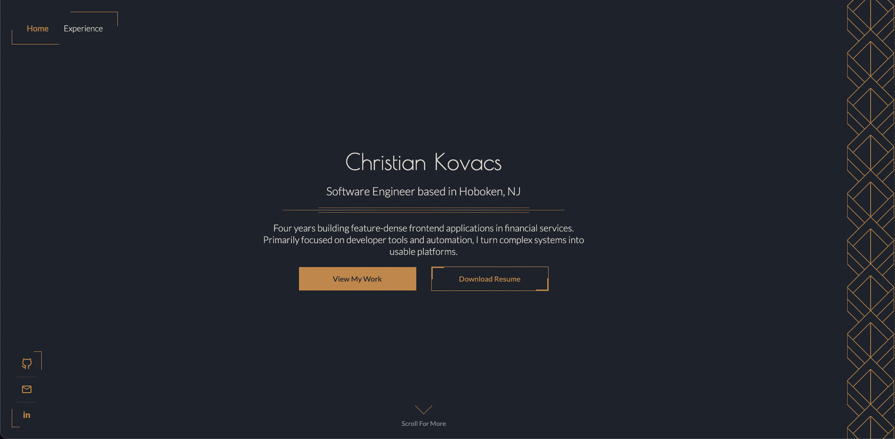
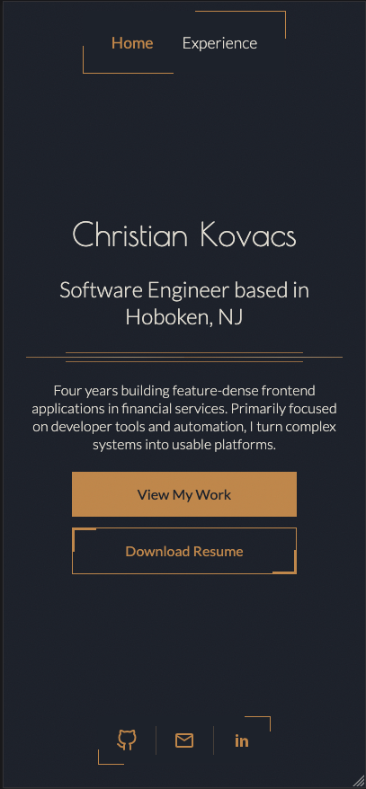

# ckovacs.dev

Personal site and portfolio. Built with React, TypeScript, and Vite.

**Live:** https://ckovacs.dev

## Design
| Desktop | Mobile |
|---|---|
|  |  |

## Stack

- React + TypeScript
- Vite
- HTML & CSS
- Deployed on CloudFlare

## Notable bits

- Art-deco visual system
- Responsive from 400px up, with fluid type and spacing via `clamp()`
- Respects `prefers-reduced-motion` throughout

## Running locally

```bash
npm install
npm run dev
```

