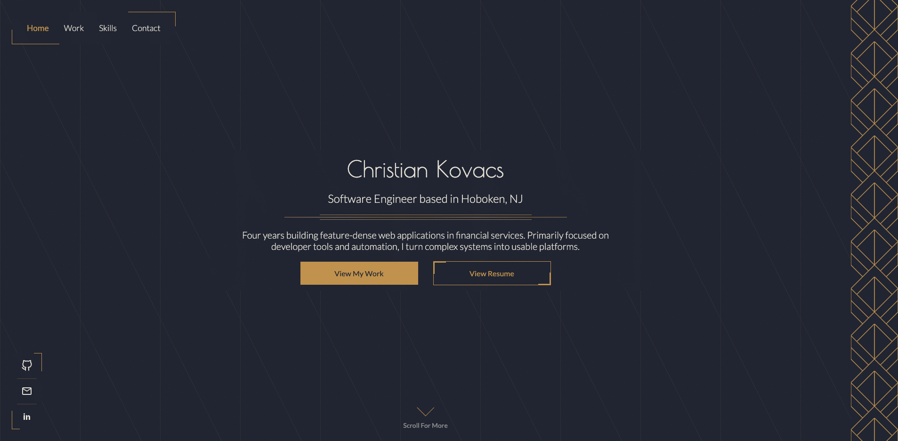
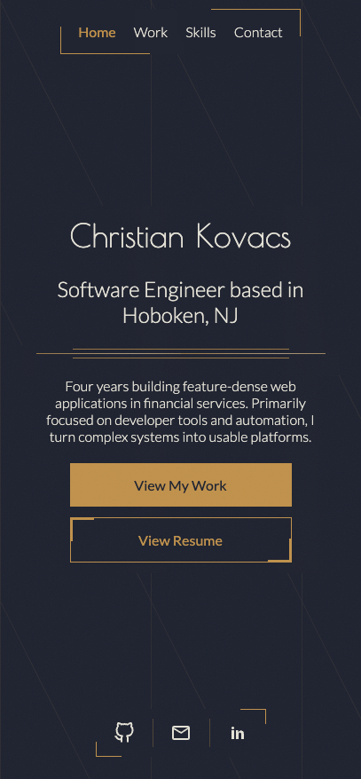
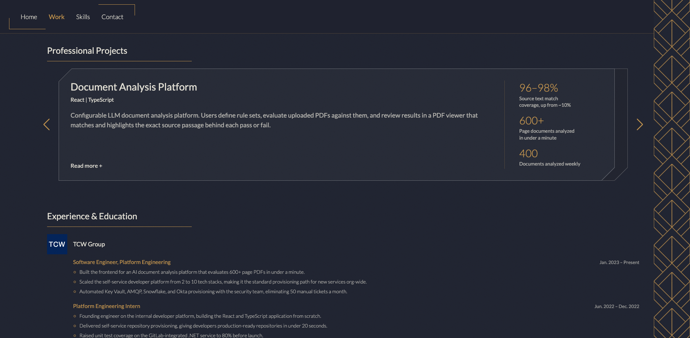
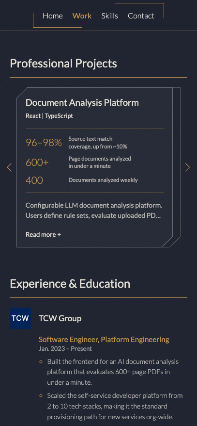

# ckovacs.dev

Personal site and portfolio. Built with React, TypeScript, and Vite.

Hand-built from the ground up to establish the core layout and art-deco styling, then refined with Claude Code to elevate the visual design and add richer interactivity.

**Live:** https://ckovacs.dev

## Design

| Desktop | Mobile |
|---|---|
|  |  |
|  |  |

## Design Ideals

- Art-deco visual system
- Responsive from 320px up, with fluid type and spacing via `clamp()`
- Respects `prefers-reduced-motion` throughout

## Stack

- React + TypeScript
- Vite
- HTML & CSS
- Deployed on CloudFlare

## Running locally

```bash
npm install
npm run dev
```